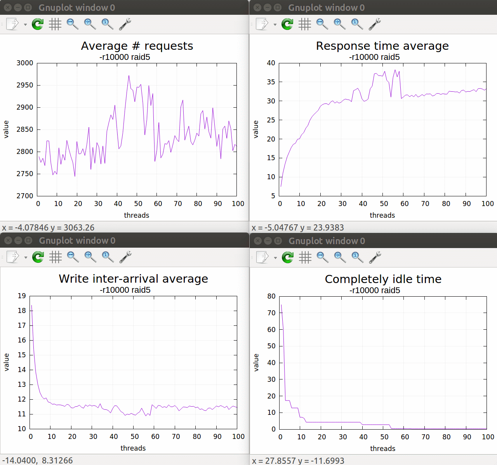

# What's DiskSim?

[DiskSim](http://www.pdl.cmu.edu/DiskSim/index.shtml) is an efficient, accurate, highly-configurable disk system simulator originally developed at the University of Michigan and enhanced at CMU to support research into various aspects of storage subsystem architecture. It is written in C and requires no special system software (just basic POSIX interfaces). DiskSim includes modules for most secondary storage components of interest, including device drivers, buses, controllers, adapters, and disk drives. DiskSim also includes support for a number of externally-provided trace formats and internally-generated synthetic workloads, and includes hooks for inclusion in a larger scale system-level simulator.

# Why to use DiskSim?
Because it's unprecedented accuracy:

# DiskSim builder and scripts

This tool helps with building DiskSim v4.0 in these ways:
* downloads base sources or these with [DIXtrac](http://www.pdl.cmu.edu/Dixtrac/index.shtml) tool
* optionally patch sources by Microsoft [SSD extension](https://www.microsoft.com/en-us/download/details.aspx?id=52332)
* optionally patch sources by Oliver Liu [64bit patch](https://github.com/myidpt/PFSsim/tree/master/disksim/64bit-ssd-patch-files)
* use additional patches in `patches/`
* optionally enforce C standard and optimization, so `disksim` can be compiled by f.e. `gcc` v5.4.0 and can run faster
* run validation tests coming with sources

Folder `scripts/` holds other useful tools including a generator of **JBOD|RAID{0|1|3|4|5}** _parv_ files.

## Download, patch and build DiskSim

### Clone this repo
```
$ git clone https://github.com/nmsudatalab/disksim-4.0.git
$ cd disksim
```

### Install requirements
It requires installed C development tools, `bison` (YACC-compatible parser generator) and `flex` (fast lexical analyzer generator).

The example of installation command for Ubuntu distribution:
```
sudo apt-get install build-essential bison flex
```

### Help for make
```
$ make help
```
```
Make patched DiskSim

Usage:
  make [options] [target ...]

Options:
          DIXTRAC=yes|no ... use DiskSim with DIXtrac        (by default: yes)
              SSD=yes|no ... use Microsoft SSD extension     (by default: yes)
           ARCH64=yes|no ... use Oliver Liu 64bit patch      (by default: yes)
    PATCHSYTHDEVS=yes|no ... patch loadsynthdevs()           (by default: yes)
  PRINTMAPREQUEST=yes|no ... print map requests              (by default: yes)
            STD=<string> ... enforce C standard thru -std=   (by default: gnu90)
       OPTIMIZE=<string> ... enforce C optimization thru -O  (by default: 2)
         TOLERANT=yes|no ... ignore patch failures           (by default: yes)
        INSTALLDIR=<dir> ... dir to install binaries         (by default: bin)

Targets:
          all ......... make sources, compile and install
          sources ..... download sources to src/
          compile ..... compile disksim in build/disksim-4.0/
          install ..... install binaries to bin/
          test ........ run valadation tests
          clean ....... delete build/
          distclean ... delete also src/
          help ........ print this help screen
```

### Build DiskSim 
```
$ make
```
```
Build configuration:
  * Use DiskSim with DIXtrac:    yes
  * Use Microsoft SSD extension: yes
  * Use Oliver Liu 64bit patch:  yes
  * Patch loadsynthdevs():       yes
  * Print map requests:          yes
  * Enforce C standard:          gnu90
  * Enforce C optimization:      2
  * Ignore patch failures:       yes
  * Install dir for binaries:    bin

...

OK, installed binaries:
-rwxrwxr-x 1 kaskhan kaskhan 606424 pro  7 03:18 bin/disksim
-rwxrwxr-x 1 kaskhan kaskhan  51784 pro  7 03:18 bin/dxcachectl
-rwxrwxr-x 1 kaskhan kaskhan  72536 pro  7 03:18 bin/dx_layout
-rwxrwxr-x 1 kaskhan kaskhan 197560 pro  7 03:18 bin/dx_mech
-rwxrwxr-x 1 kaskhan kaskhan  55960 pro  7 03:18 bin/dxreplay
-rwxrwxr-x 1 kaskhan kaskhan 700120 pro  7 03:18 bin/dx_rest
-rwxrwxr-x 1 kaskhan kaskhan 197784 pro  7 03:18 bin/dx_seeks
-rwxrwxr-x 1 kaskhan kaskhan 172888 pro  7 03:18 bin/dx_skew_curve
-rwxrwxr-x 1 kaskhan kaskhan 168696 pro  7 03:18 bin/dx_skews_simple
-rwxrwxr-x 1 kaskhan kaskhan  72376 pro  7 03:18 bin/dx_stat
-rwxrwxr-x 1 kaskhan kaskhan  10528 pro  7 03:18 bin/hplcomb
-rwxrwxr-x 1 kaskhan kaskhan  22792 pro  7 03:18 bin/mems_seektest
-rwxrwxr-x 1 kaskhan kaskhan 610552 pro  7 03:18 bin/physim
-rwxrwxr-x 1 kaskhan kaskhan  10480 pro  7 03:18 bin/rms
```

### Run validation tests
```
$ make test
```
```
[DISKSIM] Run validation test build/disksim-4.0/valid/runvalid ...
cd 'build/disksim-4.0/valid/' && sh 'runvalid'
These results represent actual drive validation experiments

QUANTUM_QM39100TD-SW (rms should be about 0.378)
rms = 0.378078

SEAGATE_ST32171W (rms should be about 0.349)
rms = 0.347863
...
```

## Scripts

### Go to script folder
```
$ cd script
```

### `disksim.sh`
```
$ ./disksim.sh 
```
```
DiskSim wrapper

Usage:
  ./disksim.sh [-q] <param_file> [ <output_file> [ <trace_file> [ <trace_type> [ <par_override> ... ] ] ] ]

Options:
  -q ............... Quiet - supress verbose messages

Arguments:
  <param_file> ..... Name of the parameter file
                     Set - for standard input

  <output_file> .... Name of the output file
                     Output can be directed to stdout by specifying 'stdout' as a basename,
                       and it quiet verbose messages. That's a default

  <trace_file> ..... Trace file to be used as input
                     Input is taken from stdin when 'stdin' is specified,
                       of course not together with <param_file> from 'stdin'
                     Synthetic workload generation portion of the simulator is enabled
                       instead of a trace file if it is empty, '-' or '0'

  <trace_type> ..... Format of the trace input, like 'ascii', 'validate', 'raw', 'hpl' ...
                     Set to 'ascii' if it's empty, '-' or '0'

  <par_override> ... Replacement for default parameter values or parameter values from <param_file>

Notes:
  * disksim runs in a folder with diskspecs (diskspecs/) and temporarily copies <param_file> here
  * it prints colored messages and resulted file list
```

### `gen_raid.sh`
```
$ ./gen_raid.sh -h
```
```
Usage:
  ./gen_raid.sh [options] jbod|raid{0|1|3|4|5} [<number_of_disks>]
  ./gen_raid.sh -h

Arguments:
  jbod|raid{0|1|3|4|5}  raid type
  <number_of_disks>     integer number of disks  (by default 3)

Options:
  -h                    show this help screen and exit
  -v                    increase output verbosity
  -m                    print mapping requests
  -o FILE               output parv filename; - for stdout         (by default -)
  -r INT                number of I/O requests to generate         (by default 1000)
  -S FLOAT              probability of sequential access <0.0,1.0> (by default 0.5)
  -R FLOAT              probability of read access       <0.0,1.0> (by default 0.5)
  -p INT                number of processes to genereate load      (by default 1)
  -u INT                stripe unit                                (by default 64)
  -s REQUEST_SIZE       disksim style request size,
                          default: 'exponential, 0.0, 8.0'

                        types of sizes:
                          uniform - requiring two floats - minimum and maximum
                            e.g. -s 'uniform, 1.0, 8.0'

                          normal - requiring two floats - mean and variance values
                                 - (stredni hodnota a hodnota rozptylu)
                                 - second value must be nonnegative
                            e.g. -s 'normal, 5.0, 4,0'

                          exponential - requiring two floats - base and mean values
                            e.g. -s 'exponential, 0.0, 16.0'

  -d DISK_NAME          disksim disk to simulate  (by default QUANTUM_TORNADO_validate)
                          available rotational disks:
                            DEC_RZ26_validate
                            HP_C2247A_validate
                            HP_C2249A
                            HP_C2490A_validate
                            HP_C3323A
                            HP_C3323A_validate
                            IBM_DNES-309170W_validate
                            QUANTUM_QM39100TD-SW
                            QUANTUM_TORNADO_validate
                            SEAGATE_ST32171W
                            SEAGATE_ST34501N_validate
                            SEAGATE_ST39102LW_validate
                            Seagate_ST41601N_validate
                          available mem disks:
                            MEMS_G1
                            MEMS_G2
                            MEMS_G3
                          available ssd disks:
                            SSD_IOZONE
```

### `run_raid_procs.sh`
```
$ ./run_raid_procs.sh
```
```
Collect and represent disksim metrics

Usage for collecting metrics:
  ./run_raid_procs.sh -p <max_num_of_processes> [gen_raid_options] jbod|raid{0|1|3|4|5} [<number_of_disks>]

Usage for get ASCII metrics:
  ./run_raid_procs.sh --ascii <metric> ...

Usage for get gnuplot metrics:
  ./run_raid_procs.sh ---gnuplot <metric> ...

Availaible metrics:
  'Average # requests'
  'Average queue length'
  'Avg # read requests'
  'Avg # write requests'
  'Base SPTF/SDF Different'
  'Batch size average'
  'Batch size maximum'
  'Batch size std.dev.'
  'Completely idle time'
  'Critical Read Response time average'
  'Critical Read Response time maximum'
  'Critical Read Response time std.dev.'
  'Critical Reads'
  'Critical Write Response time average'
  'Critical Write Response time maximum'
  'Critical Write Response time std.dev.'
  'Critical Writes'
  'End # requests'
  'End queued requests'
  'Idle period length average'
  'Idle period length maximum'
  'Idle period length std.dev.'
  'Instantaneous queue length average'
  'Instantaneous queue length maximum'
  'Instantaneous queue length std.dev.'
  'Inter-arrival time average'
  'Inter-arrival time maximum'
  'Inter-arrival time std.dev.'
  'Max # read requests'
  'Max # write requests'
  'Maximum # requests'
  'Maximum queue length'
  'Non-Critical Read Response time average'
  'Non-Critical Read Response time maximum'
  'Non-Critical Read Response time std.dev.'
  'Non-Critical Reads'
  'Non-Critical Write Response time average'
  'Non-Critical Write Response time maximum'
  'Non-Critical Write Response time std.dev.'
  'Non-Critical Writes'
  'Number of batches'
  'Number of idle periods'
  'Number of reads'
  'Number of writes'
  'Overlaps combined'
  'Physical access time average'
  'Physical access time maximum'
  'Physical access time std.dev.'
  'Priority SPTF/SDF Different'
  'Queue time average'
  'Queue time maximum'
  'Queue time std.dev.'
  'Read inter-arrival average'
  'Read inter-arrival maximum'
  'Read inter-arrival std.dev.'
  'Read overlaps combined'
  'Read request size average'
  'Read request size maximum'
  'Read request size std.dev.'
  'Request size average'
  'Request size maximum'
  'Request size std.dev.'
  'Requests per second'
  'Response time average'
  'Response time maximum'
  'Response time std.dev.'
  'runlistlen'
  'runoutstanding'
  'Sequential reads'
  'Sequential writes'
  'setsize'
  'simtime'
  'Sub-optimal mapping penalty average'
  'Sub-optimal mapping penalty maximum'
  'Sub-optimal mapping penalty std.dev.'
  'Timeout SPTF/SDF Different'
  'Total Requests handled'
  'warmuptime'
  'Write inter-arrival average'
  'Write inter-arrival maximum'
  'Write inter-arrival std.dev.'
  'Write request size average'
  'Write request size maximum'
  'Write request size std.dev.'
```


### Examples

#### Print overall I/O stats from RAID5
```
$ ./gen_raid.sh raid5 | ./disksim.sh - | ./filter_overall.pl
```
```
Total Requests handled:                    1000
Requests per second:                       52.113620
Completely idle time:                      75.004636    0.003909
Response time average:                     7.294895
...
```

#### Print IOPS stats from RAID0
```
$ ./gen_raid.sh raid0 | ./disksim.sh - | ./filter_iops.pl
```
```
Average latency  [ms]:         4.18640
RAID   I/O per second:        62.18773
RAID    kB per second:       392.03146
DISK#0 I/O per second:        24.31540
DISK#0  kB per second:       140.43385
```

#### Print mappings for all supported RAIDs
```
$ for raid in jbod raid0 raid1 raid3 raid4 raid5; do
   ./gen_raid.sh -m -r20 -R0.0 -u1 ${raid} 4 | ./disksim.sh - | ./filter_map_requests.pl
  done
```
```
Mapping for logorg jbod:

     block   disk0               
  ---------+--------------------
   1992757   0                   
   1992758   1                   
   1992759   2                   
   1992760   3                   
   1992761   4                   
   1992762   5                   
   1992763   6                   
   1992764   7                   
   1992765   8                   
   1992766   9                   
   1992767   10                  
   1992768   11                  
   1992769   12                  
   1992770   13                  
   1992771   14                  
   1992772   15                  
   1992773   16                  
   1992774   17                  
   1992775   18                  
   1992776   19                  


Mapping for logorg raid0:

     block   disk0                disk1                disk2                disk3               
  ---------+--------------------+--------------------+--------------------+--------------------
    498189                        0                    1                    2                   
    498190   3                    4                    5                    6                   
    498191   7                    8                    9                    10                  
    498192   11                   12                   13                   14                  
    498193   15                   16                   17                   18                  
    498194   19                                                                                 


Mapping for logorg raid1:

     block   disk0                disk1                disk2                disk3               
  ---------+--------------------+--------------------+--------------------+--------------------
   1992757   0                    0                    0                    0                   
   1992758   1                    1                    1                    1                   
   1992759   2                    2                    2                    2                   
   1992760   3                    3                    3                    3                   
   1992761   4                    4                    4                    4                   
   1992762   5                    5                    5                    5                   
   1992763   6                    6                    6                    6                   
   1992764   7                    7                    7                    7                   
   1992765   8                    8                    8                    8                   
   1992766   9                    9                    9                    9                   
   1992767   10                   10                   10                   10                  
   1992768   11                   11                   11                   11                  
   1992769   12                   12                   12                   12                  
   1992770   13                   13                   13                   13                  
   1992771   14                   14                   14                   14                  
   1992772   15                   15                   15                   15                  
   1992773   16                   16                   16                   16                  
   1992774   17                   17                   17                   17                  
   1992775   18                   18                   18                   18                  
   1992776   19                   19                   19                   19                  


Mapping for logorg raid3:

     block   disk0                disk1                disk2                disk3               
  ---------+--------------------+--------------------+--------------------+--------------------
    664252                        0                    1                    0,1                 
    664253   2                    3                    4                    2,3,4               
    664254   5                    6                    7                    5,6,7               
    664255   8                    9                    10                   8,9,10              
    664256   11                   12                   13                   11,12,13            
    664257   14                   15                   16                   14,15,16            
    664258   17                   18                   19                   17,18,19            


Mapping for logorg raid4:

     block   disk0                disk1                disk2                disk3               
  ---------+--------------------+--------------------+--------------------+--------------------
    664252                        0                    1                    0,1                 
    664253   2                    3                    4                    2,3,4               
    664254   5                    6                    7                    5,6,7               
    664255   8                    9                    10                   8,9,10              
    664256   11                   12                   13                   11,12,13            
    664257   14                   15                   16                   14,15,16            
    664258   17                   18                   19                   17,18,19            


Mapping for logorg raid5:

     block   disk0                disk1                disk2                disk3               
  ---------+--------------------+--------------------+--------------------+--------------------
    664252                        0                    1                    0,1                 
    664253   3                    4                    2,3,4                2                   
    664254   7                    5,6,7                5                    6                   
    664255   8,9,10               8                    9                    10                  
    664256   11                   12                   13                   11,12,13            
    664257   15                   16                   14,15,16             14                  
    664258   19                   17,18,19             17                   18                  

```

#### Collect metrics for RAID5 with 10000 requests for 1-100 parallel processes
```
$ ./run_raid_procs.sh -p100 -r10000 raid5
```
```
Collecting metrics for 100 threads ... done (in .work/metrics_*.out)
```

#### Print collected metric for 1-100 parallel processes to a screen
```
./run_raid_procs.sh --ascii 'Response time average'
```
```
00000001 threads: 7.430611
00000002 threads: 11.030188
00000003 threads: 13.360172
00000004 threads: 15.235009
00000005 threads: 16.508526
00000006 threads: 17.762317
...
```

#### Show collected metrics for 1-100 parallel processes as a pictures
```
./run_raid_procs.sh --gnuplot 'Average # requests' 'Response time average' 'Write inter-arrival average' 'Completely idle time'
```

